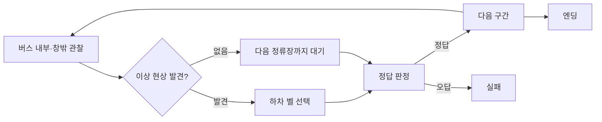
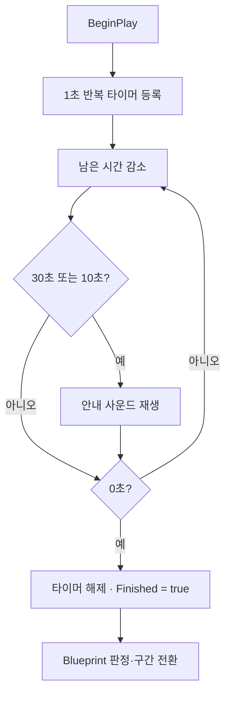

<div align="center">

# 심야버스 (Last Bus Home)

**막차 안의 이상 현상을 판별해 무사히 퇴근하는 1인칭 호러 추리 게임**


[▶ 플레이 영상](https://youtu.be/5aA2pDTVSRs) · [포트폴리오](https://hwang-doyeon-game-dev.hwangdy135.chatgpt.site/) · [상세 개발 기록](https://app.notion.com/p/3cef1fce5d168109a1fec23ab0b1231a)

</div>

[](https://youtu.be/5aA2pDTVSRs)

## 프로젝트 개요

| 구분 | 내용 |
| --- | --- |
| 개발 기간 | 2024.12.16–2024.12.17 · 20시간 |
| 개발 형태 | 2인 팀 · 팀장 · 개인 기여도 약 60% |
| 담당 | 게임 기획 · 레벨 디자인 · 이상 현상 및 점프 스케어 · 구간 타이머 |
| 장르 | 1인칭 호러 · 추리 · 서스펜스 |
| 개발 환경 | Unreal Engine 5.3 · C++ · Blueprint |
| 결과 | 판별·선택·구간 이동·엔딩을 갖춘 MVP · 수상 없음 |

퇴근길 마지막 버스에 탄 플레이어가 내부와 창밖의 변화를 관찰하고, 이상 현상이 있다면 하차 벨을 눌러야 하는 게임입니다. 직접적인 설명을 줄이고 **안내 방송, 벨 소리, 구간 전환**으로 판단 결과를 전달했습니다.



## 플레이 화면

| 창밖의 이상 현상 | 버스 뒤편의 인물 |
| --- | --- |
|  |  |

| 작은 화면만 켜진 내부 | 좌석 아래의 이상 현상 |
| --- | --- |
|  |  |

## 담당 역할과 팀 작업의 경계

### 내가 담당한 범위

- 게임잼 제시어인 `버스`와 `잼`을 반복 판별 구조의 1인칭 호러 게임으로 구체화
- 20시간 안에 **판별 → 선택 → 구간 이동 → 엔딩**까지 이어지는 MVP 범위 결정
- 버스 내부 플레이 요소, 어두운 시골길, 이상 현상의 구간별 배치와 레벨 디자인
- 창문을 치는 시체, 좌석 아래 시체, 특정 위치에서 나타나는 오브젝트 등 공포 연출
- Collider Trigger를 이용한 점프 스케어와 TTS 안내 방송 적용
- 60초 구간 타이머, 30초·10초 안내음, 종료 상태를 Blueprint에 전달하는 C++ 구현
- 번호형 진행 맵과 Happy/Bad 엔딩, 튜토리얼·클리어·게임오버 UI 구성

### 팀원이 담당한 범위

- Stop 버튼 모델과 기능
- 플레이어 이동 및 상호작용

저장소 전체를 단독 구현한 것으로 표현하지 않습니다. 특히 [`StopButton`](GameJam24Winter/Source/GameJam24Winter/StopButton.cpp)은 팀 결과물이며, 위 개인 담당 항목과 구분합니다.

## 클라이언트 구현 포인트

### 구간 타이머와 청각 피드백

[`CountdownTimer.cpp`](GameJam24Winter/Source/GameJam24Winter/CountdownTimer.cpp)는 프레임별 `Tick` 대신 Unreal의 타이머 매니저로 1초마다 남은 시간을 갱신합니다.

- 기본 제한 시간은 60초입니다.
- 30초와 10초에 서로 다른 안내 사운드를 재생합니다.
- 시간이 끝나면 `Finished`를 변경해 Blueprint가 판정 흐름을 이어갈 수 있게 했습니다.
- `MapResult`를 `BlueprintReadWrite`로 노출해 레벨별 결과와 Blueprint 로직을 연결했습니다.



### 여러 레벨을 하나의 진행으로 연결

저장소에는 `Level0`부터 `Level6`까지 7개의 번호형 진행 맵, `HappyEnd`와 `BadEnd` 2개의 엔딩 맵이 있습니다. [`DefaultEngine.ini`](GameJam24Winter/Config/DefaultEngine.ini)는 `PassLevel` GameInstance를 지정하며, Blueprint 자산을 통해 구간 판정 상태를 다음 레벨로 넘기는 구조입니다.

| 영역 | 저장소 근거 |
| --- | --- |
| 엔진 버전 | [`GameJam24Winter.uproject`](GameJam24Winter/GameJam24Winter.uproject) — `EngineAssociation: 5.3` |
| 구간 타이머 | [`CountdownTimer.h`](GameJam24Winter/Source/GameJam24Winter/CountdownTimer.h), [`CountdownTimer.cpp`](GameJam24Winter/Source/GameJam24Winter/CountdownTimer.cpp) |
| 진행 맵 | [`Content/Level`](GameJam24Winter/Content/Level) — Level0–6, HappyEnd, BadEnd |
| 상태 유지 | [`PassLevel.uasset`](GameJam24Winter/Content/FirstPerson/Blueprints/PassLevel.uasset), [`DefaultEngine.ini`](GameJam24Winter/Config/DefaultEngine.ini) |

## 20시간 안의 범위 결정

이상 현상 아이디어를 충분히 발산하지 못해 콘텐츠의 수와 참신함이 부족하다는 문제가 있었습니다. 남은 시간에는 시스템을 더 넓히기보다 이미 선정한 이상 현상과 소리 피드백을 구간 전환·두 엔딩까지 연결하는 데 집중했습니다.

| 판단 | 결과 |
| --- | --- |
| 반드시 완성 | 이상 현상을 관찰하고 벨로 판단하는 1회 이상의 완전한 루프 |
| 우선한 피드백 | 안내 방송과 벨 소리로 성공·이동 여부 전달 |
| 축소한 범위 | 이상 현상과 스테이지 수의 추가 확장 |
| 최종 결과 | 여러 구간의 판별과 최종 엔딩까지 플레이 가능한 MVP |

이 경험을 통해 판별형 호러에서는 시스템뿐 아니라 **콘텐츠 목록, 차별화 기준, 구현 난이도**를 초기에 함께 확정해야 한다는 점을 배웠습니다.

## 소스 실행

> 이 저장소의 Unreal 프로젝트는 루트가 아니라 `GameJam24Winter/` 하위 폴더에 있습니다.

```bash
git clone https://github.com/doyeon-SM/2024GameJam.git
cd 2024GameJam/GameJam24Winter
```

1. Unreal Engine **5.3**과 C++ 프로젝트 빌드가 가능한 Visual Studio 환경을 준비합니다.
2. [`GameJam24Winter.uproject`](GameJam24Winter/GameJam24Winter.uproject)를 Unreal Engine 5.3으로 엽니다.
3. 모듈 재빌드 안내가 나타나면 프로젝트 파일을 생성하고 `GameJam24WinterEditor`를 빌드합니다.
4. 프로젝트 설정상 기본 시작 맵은 `/Game/FirstPerson/Maps/FirstPersonMap`입니다.
5. 게임잼의 번호형 진행 맵을 확인하려면 Content Browser에서 `/Game/Level/Level0`을 열고 PIE로 실행합니다.

저장소에서 엔진 버전, 기본 맵, C++ 모듈, 레벨 자산의 존재를 확인했습니다. 다만 이 README 작성 환경에는 Unreal Engine 5.3이 없어 **새 환경에서의 전체 빌드·패키징까지 재검증하지는 못했습니다.** 패키징된 실행 파일은 포함되어 있지 않으므로 완성된 플레이 흐름은 [플레이 영상](https://youtu.be/5aA2pDTVSRs)에서 먼저 확인할 수 있습니다.

## 결과와 한계

- 판별, 선택, 구간 이동, 성공·실패 엔딩을 갖춘 20시간 MVP를 완성했습니다.
- 7개 번호형 맵과 2개 엔딩 맵으로 반복 판별 흐름을 구성했습니다.
- 이상 현상의 수와 차별성은 목표만큼 확보하지 못했습니다.
- 후속 개발에서는 대표 기믹을 먼저 플레이 테스트하고, 콘텐츠 목록과 레벨별 감각 변화를 초반에 확정할 계획입니다.

## 링크

- [YouTube — 플레이 영상](https://youtu.be/5aA2pDTVSRs)
- [Notion — 상세 개발 기록](https://app.notion.com/p/3cef1fce5d168109a1fec23ab0b1231a)
- [GitHub — 본인 커밋 기록](https://github.com/doyeon-SM/2024GameJam/commits/main/?author=doyeon-SM)
- [Google Slides — 게임잼 발표 자료](https://docs.google.com/presentation/d/1PMg7JV2xIfHpziQpSMGfspYvawQI--GL/edit?usp=sharing&ouid=109653056798105471862&rtpof=true&sd=true)
- [황도연 게임 개발 포트폴리오](https://hwang-doyeon-game-dev.hwangdy135.chatgpt.site/)
